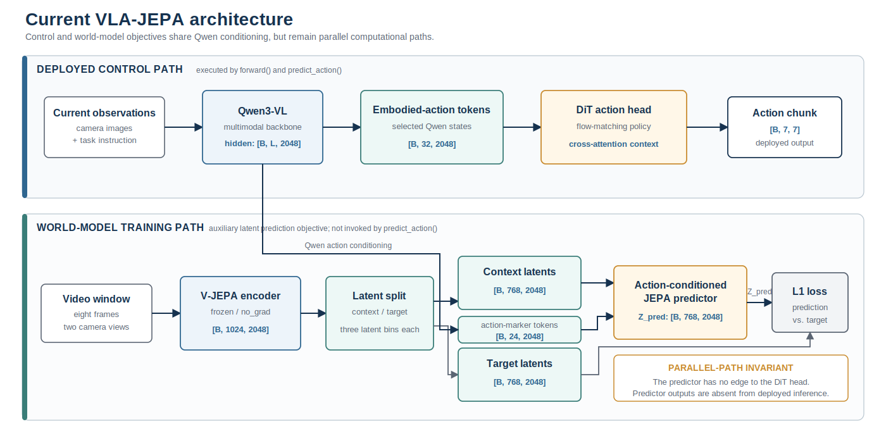
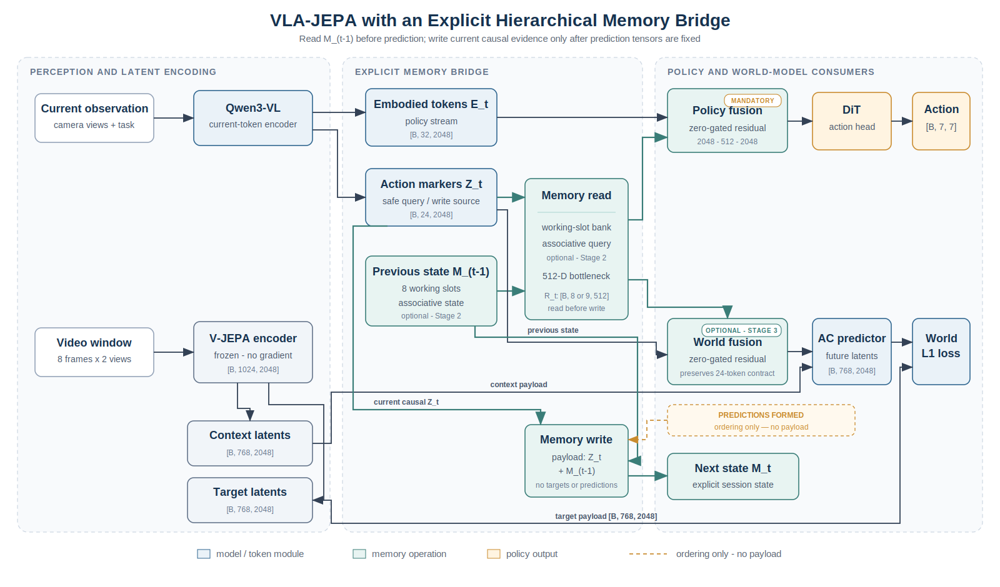
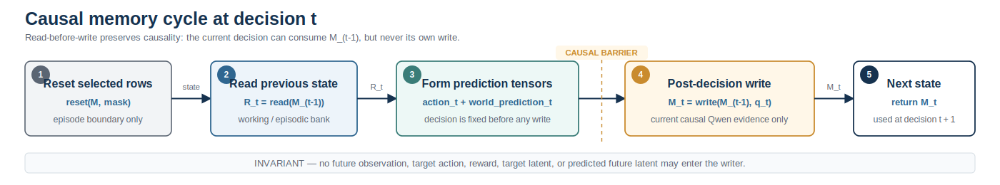

# VLA-JEPA Memory Architecture

> Status: architecture proposal; no memory implementation is present yet.
>
> Decision: build memory as an explicit, state-passing bridge after Qwen and before the action and world-model consumers. Ship short-term recurrent slots first. Add bounded associative long-term memory only after the short-term path shows a causal gain.
>
> Companion documents: [implementation plan](VLA-JEPA-Memory-Implementation-Plan.md) and [evaluation plan](VLA-JEPA-Memory-Evaluation-Plan.md).

## 1. Executive decision

The first memory implementation should be a small recurrent module over causally safe Qwen tokens:

1. Qwen encodes the current camera observations and task text.
2. The previous working slots form the read bank; a pooled current Qwen action-marker representation queries the optional associative tier.
3. A normally initialized bottleneck adapter behind a zero-initialized scalar gate injects the read into the embodied tokens used by the DiT action head. This action-path connection is mandatory.
4. The same read can later condition the existing JEPA action tokens without changing the predictor's token layout.
5. Only after predictions are formed does the module write the current Qwen tokens into the next memory state.
6. Runtime state is passed explicitly. It is never stored as a batch-shaped model buffer.

The target design has two bounded tiers:

| Tier | State | Update cadence | Purpose |
|---|---|---:|---|
| Working memory | 8 recurrent slots, `[B, 8, 512]` | every policy decision | recent observations, task phase, local temporal evidence |
| Episodic memory | gated-delta state, `[B, 128, 128]` in FP32 | every policy decision, with learned retention | longer-delay key/value associations |

The episodic tier is a later stage, not an MVP prerequisite. A working-memory-only model is the first credible experiment.

## 2. Why the previous proposal is replaced

The previous document put recurrent tokens primarily inside the JEPA predictor and treated action-head conditioning as optional. Code inspection shows that this cannot improve deployed actions in the current architecture:

- `VLA_JEPA.forward()` trains both the JEPA predictor and the action head.
- `VLA_JEPA.predict_action()` runs Qwen and the DiT action head only. It never calls the V-JEPA encoder or JEPA predictor.
- `predicted_states` are not consumed by the action head in training either.

Therefore, predictor-only memory can change `wm_loss` while leaving LIBERO actions unchanged. Memory must condition the DiT path in both training and inference.

The previous proposal also contained several correctness problems that this design explicitly fixes:

- Qwen is not inherently frozen. The current all-data configuration freezes only `vj_encoder` and assigns Qwen a learning rate; the V-JEPA encoder forward is also unconditionally wrapped in `torch.no_grad()`.
- The current robot dataset samples unrelated random steps. Carrying state across batches would mix episodes and datasets.
- `input_states` are not a safe memory-write source for policy memory. They are produced from an eight-frame video window and can contain information after the action decision time.
- Arbitrary global prefix tokens do not fit the current predictor. `ACRoPEAttention` reshapes every token as a per-timestep action-or-spatial token.
- A mutable model buffer would leak across the VLA and SSV2 passes, DDP ranks, episodes, and WebSocket clients.
- The current evaluation client clears only client-local history. The server has no working reset route.
- A recurrent graph cannot be carried through an optimizer step. Differentiable memory training requires multiple ordered decisions inside one forward/backward unroll.

## 3. Current architecture, as implemented

The relevant default dimensions in `scripts/config/vlajepa_cotrain_all.yaml` are:

| Signal | Shape under the current all-data config | Consumer |
|---|---|---|
| Qwen hidden states | `[B, L, 2048]` | token extraction |
| Qwen action-marker states | `[B, 24, 2048]` | JEPA action conditioning |
| Qwen embodied-action states | `[B, 32, 2048]` | DiT cross-attention |
| Two-view V-JEPA features | `[B, 1024, 2048]` | context/target split |
| JEPA predictor input states | `[B, 768, 2048]` | AC predictor |
| JEPA target states | `[B, 768, 2048]` | L1 target |
| Action target | `[B, 7, 7]` | flow-matching loss |

Eight raw frames become four V-JEPA latent time bins because the encoder tubelet size is two. The predictor receives three latent context bins. Each bin contains eight Qwen action tokens and 256 spatial tokens, so its internal sequence has `3 × (8 + 256) = 792` tokens.

The control path and world-model path are parallel, not serial:



*Figure 1. Current VLA-JEPA computation graph. Qwen embodied-action tokens drive the deployed DiT control path, while action-marker tokens condition the parallel V-JEPA world-model path during training; predictor outputs do not feed the action head.*

Memory must be inserted at the fork after Qwen so it can affect the deployed control path and, optionally, the world-model path.

## 4. Architectural invariants

The implementation must preserve these invariants:

1. **Train/deploy parity.** A memory feature that cannot affect `predict_action()` is not policy memory.
2. **Causal writes.** Policy memory may consume only current observations, current task text, current proprioception, and already-executed actions. It must never consume future video frames, target actions, rewards, `gt_states`, or predicted future latents.
3. **Read before write.** Decision `t` reads state `M_(t-1)`. Current evidence is written into `M_t` only after the decision tensors have been produced.
4. **Explicit state.** Runtime state is an input/output activation, not a registered buffer or singleton cache on the model.
5. **Per-sample reset.** A reset mask can clear one batch row without affecting another.
6. **No cross-stream carry.** Robot and SSV2 batches never share memory state.
7. **Bounded cost.** State size and per-decision work do not grow with episode length.
8. **Disabled means baseline.** With `framework.memory.enabled: false`, module construction, checkpoint keys, and outputs remain unchanged.
9. **Side-effect-free forward.** Activation checkpointing or recomputation must not perform a second hidden write.

## 5. Recommended placement: post-Qwen memory bridge



*Figure 2. Proposed memory bridge at policy decision \(t\). The policy and optional world-model adapters read \(M_{t-1}\); causal current evidence is written to \(M_t\) only after prediction tensors are formed. The associative tier is a deferred Stage-2 component.*

The Qwen action-marker states are the canonical memory write source because the configured prompts contain them in robot, SSV2, training, and inference. They depend on the current images and task but not on future labels. `predict_action()` currently extracts only embodied tokens; extracting action-marker tokens there is a required code change.

### 5.1 Why residual cross-attention is the default fusion

The action head already accepts variable-length cross-attention context, so concatenating memory tokens would work. A residual adapter is safer for warm-starting, however:

Define `R_t` as the eight previous working slots `[B,8,512]`. When the associative tier is enabled, project its `[B,128]` read to one 512-wide token and append it, producing `[B,9,512]`. Policy and world adapters attend in the 512-dimensional bottleneck:

```text
Qp = Wq_policy LN(E_t)                         # [B,32,512]
Yp = Attention(Q=Qp, K=LN(R_t), V=LN(R_t))    # [B,32,512]
E'_t = E_t + tanh(gamma_policy) * Wo_policy(Yp)  # [B,32,2048]

Qw = Wq_world LN(A_t)                          # [B,24,512]
Yw = Attention(Q=Qw, K=LN(R_t), V=LN(R_t))    # [B,24,512]
A'_t = A_t + tanh(gamma_world) * Wo_world(Yw)  # [B,24,2048]
```

The adapter weights use normal initialization and only `gamma_policy`/`gamma_world` start at zero. This is an exact functional no-op at initialization without permanently killing the branch. On the first backward at exact zero, only the scalar gate receives gradient; memory and adapter gradients begin after the gate moves. A Phase-1 run may warm the gate briefly or initialize it to a documented small nonzero value after the parity test. The sequence shapes and existing DiT/predictor APIs do not change.

Appending projected slots to the DiT context is a valid ablation. It should not be the only implementation because zero-valued appended tokens can still change the attention softmax denominator and therefore are not an exact baseline initialization.

### 5.2 Why memory is not inserted into Qwen first

Qwen-prefix or Qwen-KV memory would offer deep fusion, but it also changes multimodal positions, chat-template construction, tokenization assumptions, and the 2B-parameter backbone's compute path. It is a useful later experiment only after the bridge demonstrates value.

### 5.3 Why memory is not prepended to the predictor first

The predictor and `ACRoPEAttention` assume all non-spatial tokens repeat inside every time bin. A global prefix breaks the `view(B, T, action_tokens + H*W, C)` contract and needs a new mask and a separate NoPE/temporal-only QKV path. More importantly, that state is absent from deployed inference. The bridge obtains world-model conditioning by preserving the predictor's existing 24-token action interface.

## 6. Runtime state and module contract

Runtime state should be represented by a typed, non-persistent object:

```python
@dataclass
class MemoryState:
    working: Tensor          # [B, 8, 512], always FP32
    episodic: Tensor | None  # [B, 128, 128], FP32; disabled in Stage 1
    steps: Tensor            # [B], int64; completed policy decisions
    valid: Tensor            # [B], bool; active, non-padding episode rows

@dataclass
class MemoryRead:
    tokens: Tensor           # [B, 8 or 9, 512]
    diagnostics: dict[str, Tensor]
```

The proposed module surface is:

```python
init_state(batch_size, device) -> MemoryState
reset_state(state, reset_mask) -> MemoryState
read(context_tokens, state) -> MemoryRead
write(context_tokens, state, update_mask) -> MemoryState
diagnostics(state, read) -> dict[str, Tensor]
```

`read()` and `write()` are pure tensor functions. Learned initial slots, projections, attention layers, and gates are module parameters; episode content is not.

`state=None` or a reset row expands the learned working initialization, zeros the episodic matrix, sets `steps=0`, and marks a real row valid. Padded rows remain invalid: they contribute no loss, read, write, or step increment. Reset happens before read; a terminal row is invalidated after its final decision. Batch size, row identity, device, or shape changes without an explicit reset are errors. Reset is out of place so rows not selected by the mask cannot alias modified storage.

Only `forward_sequence()` may return graph-bearing state. Stepwise training state is detached before it can cross an optimizer update; inference state is always detached under inference mode.

The framework API becomes:

```python
forward(examples, memory_state=None, reset_mask=None, return_memory_state=False)
predict_action(..., memory_state=None, reset_mask=None, return_memory_state=False)
```

Backward compatibility is preserved when memory is disabled. Sequence training can use a dedicated `forward_sequence()` output object so the existing trainer never accidentally sums state or diagnostics as losses.

## 7. Short-term working memory

Start with eight 512-dimensional slots:

```text
H_(t-1) in R^[B x 8 x 512]
Z_t      in R^[B x 24 x 2048]
X_t = W_in Z_t

C_t = CrossAttention(Q=LN(H_(t-1) + slot_id), K=LN(X_t), V=LN(X_t))
g_t = sigmoid(W_g [LN(H_(t-1)); LN(C_t)] + b_g)
H_t = (1 - g_t) * H_(t-1) + g_t * tanh(W_c C_t)
```

Layer normalization is applied when slots are queried or read, not to the stored convex update; therefore `g_t=0` is an exact keep operation. The gate bias should begin near a modest update probability, such as `sigmoid(b_g) ≈ 0.1`, rather than forcing permanent retention. Slot identity embeddings discourage all slots from collapsing to the same summary.

The policy read uses `H_(t-1)`, never `H_t`. Gradients from decision `t` reach the write at `t-1` when multiple decisions are unrolled inside the same backward pass.

## 8. Long-term episodic memory

Add the long-term tier only after working memory passes the causal-use gate in the evaluation plan. The recommended bounded associative state is a gated delta memory:

```text
S_(t-1) in R^[B x Dv x Dk]      Dk = Dv = 128
z_t = AttentionPool(W_z Z_t)     z_t in R^[B x 512]
q_t, k_t in R^[B x Dk]          normalized
v_t      in R^[B x Dv]
beta_t   in [0,1]
lambda_t in [0,1]

q_t = normalize(W_q z_t)
k_t = normalize(W_k z_t)
v_t = W_v z_t
beta_t = sigmoid(w_beta^T z_t + b_beta)
lambda_t = 2^(-delta_steps / half_life_t)
half_life_t = half_life_min + softplus(w_h^T z_t + b_h)

read:       r_t = S_(t-1) q_t
decay:      S_bar = lambda_t S_(t-1)
residual:   e_t = v_t - S_bar k_t
write:      S_t = S_bar + beta_t e_t k_t^T
```

This orientation is deliberate: `S` has shape `[Dv, Dk]`, so both `S q` and `(v - S k) k^T` are dimensionally valid. The state and update should remain FP32; the projected read can be cast to the model dtype.

`delta_steps` is the number of policy decisions represented by this update and is one under the initial fixed-cadence setup. Project `r_t [B,128]` to one `[B,1,512]` token and append it to the working read bank. Parameterize retention using a positive half-life, not a raw sigmoid initialized near 0.5. An initial half-life of roughly 128-512 policy decisions is a later sweep range, but training cannot claim that horizon unless its unroll/burn-in or auxiliary retrieval objective supplies credit at comparable delays. Log the Frobenius norm, effective rank, write residual, and retention gate to detect saturation.

All recurrence, pooling, q/k/v projection, and gated-delta operations run in an explicit FP32/autocast-disabled island. Cast Qwen source tokens to FP32 on entry and cast only the final residual back to the consumer dtype. This rule still applies when serving calls `model.to(torch.bfloat16)`: the memory module must be restored or kept in FP32 after the global cast.

If associative memory does not beat a second set of slowly updated recurrent slots, keep the simpler two-timescale slot design. Titans-style test-time parameter updates are explicitly out of scope until fixed-state capacity is proven to be the bottleneck.

## 9. Causality and leakage rules

### Safe write sources

- Qwen action-marker states derived from the current images and instruction.
- Current proprioception, when present.
- Previously issued action chunks, but only after they have been issued.
- Explicit time delta or decision index.

### Forbidden write sources

- `gt_states` or any future target representation.
- The full V-JEPA `input_states` from the current eight-frame robot window.
- Future action labels from the sampled action chunk.
- Predicted future states committed as factual memory.
- Reward, success labels, or terminal outcomes unavailable at deployment time.

The correct order at decision `t` is:



*Figure 3. Per-decision memory transaction. Selected rows reset before reading \(M_{t-1}\); action and world tensors are formed before current causal evidence is committed to \(M_t\).*

A future-perturbation test must prove that changing observations or labels after time `t` does not change the Qwen memory source, memory write, DiT conditioning, or action at `t` under fixed flow noise. World predictions/loss may legitimately change when their explicit video context or target changes; they are not the invariant under this test.

## 10. Training semantics

The existing random-step mixture cannot train recurrence. Each training item must instead be a contiguous segment from one composite episode identity:

```text
(dataset_id, episode_id, base_step_0 ... base_step_K-1)
```

Recommended first settings:

| Setting | Initial value | Reason |
|---|---:|---|
| supervised segment | 4 decisions | enough delayed gradient with manageable activation cost |
| burn-in prefix | same-episode, variable up to a configured maximum | reconstructs state for mid-episode starts |
| segment stride | derived from dataset cadence; 7 transitions for current LIBERO | matches deployment decisions without assuming all robot datasets share FPS |
| TBPTT length | 4 | one complete initial segment |
| working slots | 8 × 512 | small fixed state |
| memory state dtype | FP32 | recurrent numerical stability |
| direct-context dropout | 0.0 initially, then 0.1 sweep | discourages memory collapse only if needed |

Do not reset an arbitrary mid-episode segment and treat it as deployed state. Either sample from the true episode start or prepend earlier same-episode decisions as burn-in. Burn-in updates state without supervised loss and may be detached before the supervised segment. Return distinct `segment_start`, actual `is_first`, `is_last`, `sequence_valid`, `loss_mask`, and `update_mask` fields.

Sequence indices must come from raw trajectory base indices, not positions in a pause-filtered `all_steps` list. Disable pause deletion initially or prove the retained indices preserve time. Derive stride from action-chunk/replanning configuration and dataset-specific time units; assert the train/eval cadence for each embodiment rather than hard-coding seven globally.

Qwen and V-JEPA encodings can be vectorized over `B × K`; the cheap memory recurrence remains sequential over `K`. Sum losses over valid supervised decisions and divide by their count so padding and segment length do not change gradient scale. Perform one optimizer update after the full segment. Never retain a recurrent graph across `optimizer.step()`.

The VLA and SSV2 passes in co-training use independent state objects. Stage 1 is a robot-only trainer: freeze `qwen_vl_interface`, `vj_encoder`, and `vj_predictor`, train the action head plus memory/fusion modules, and skip the SSV2 optimizer pass and world-model loss entirely. A frozen predictor leaves no trainable SSV2 path, so merely resetting SSV2 memory is insufficient. A later ordered SSV2 segment loader can train world-model memory separately after the predictor is unfrozen.

This robot-only warm start is a deliberate new experiment setting; it is not a description of the current allv2 run, where Qwen and the predictor were trainable.

## 11. Inference and session lifecycle

The server, not the model singleton, should own episode state. The MVP supports exactly one batch row (`B=1`) per WebSocket connection:

- One `MemoryState` and one private `torch.Generator` per connection.
- A real `type: reset` protocol message that clears the selected session.
- Reset seeds both memory and the per-session generator from an explicit episode seed.
- State and RNG deletion on reset, disconnect, timeout, and server shutdown.
- No memory tensor serialized to the client on every action request.
- No shared batch-shaped buffer on the policy object.
- Reject live-memory requests whose batch size or row identity changes. Batched/multiplexed serving is a later design requiring `session_ids[B]` and one state per stable row.

Required current-stack fixes:

1. Add a reset route to `deployment/model_server/tools/websocket_policy_server.py`.
2. Make `WebsocketClientPolicy.reset()` send an explicit typed reset request.
3. Make `M1Inference.reset()` call the client's reset method.
4. Pass the connection-local state and generator into `predict_action()` and the action head without adding them to the public response dictionary.
5. Commit `state_after` and RNG advancement only after successful inference; a failure leaves `state_before` intact or explicitly invalidates the session.
6. Add a two-client memory-and-RNG isolation test.

LIBERO currently invokes the policy only once per seven-action chunk. Memory therefore advances once per chunk, not once per simulator step. Training stride must match this unless evaluation is changed to replan more frequently.

## 12. Checkpoint and distributed-training behavior

Learned memory parameters belong in the normal model `state_dict`; runtime episode state does not.

- With memory disabled, do not instantiate memory modules. Existing 100K checkpoints continue to strict-load exactly.
- Upgrading the 100K checkpoint to an enabled memory config requires an allowlisted migration. Put all recurrent and fusion parameters under `memory_module.*`, or explicitly allowlist every new prefix; any other mismatch remains fatal. Both `TrainerUtils.load_pretrained_backbones` and `baseframework.from_pretrained` currently strict-load and need a defined migration/config-override path.
- Accelerate full-state checkpoints automatically include memory parameters and optimizer state once the module exists.
- Exported inference checkpoints include learned memory parameters but start with no episode state.
- DDP ranks own only the activation state for their local sequence batch.
- Requeue/resume begins with new sampled segments; no mid-episode activation state is restored.

## 13. Considered alternatives

| Option | Decision | Reason |
|---|---|---|
| Longer image history only | keep as required baseline | simple, but fixed horizon and growing visual compute |
| Predictor prefix tokens | postpone | no direct deployment effect; mask/RoPE/reshape surgery |
| Qwen prefix/KV memory | postpone | invasive multimodal position and checkpoint changes |
| DiT-internal mutable state | reject | could update once per denoising iteration and lacks world supervision |
| Global model buffer | reject | episode/client/DDP/cotrain leakage |
| External vector database | reject for first version | unbounded systems complexity and weak end-to-end training |
| Working recurrent slots | implement first | smallest credible train/deploy-aligned memory |
| Gated-delta associative state | implement only after Stage 1 | bounded long-delay recall with modest cost |
| Titans/test-time training | research fallback | inner optimization is unjustified before capacity evidence |

## 14. Success criteria for the architecture

The design is accepted only if all of the following hold:

- Memory-disabled outputs match the existing model.
- Reset makes episode-B outputs independent of episode-A history.
- Two simultaneous clients cannot observe each other's state.
- Perturbing future frames or targets cannot affect an earlier decision.
- Live memory beats zeroed or shuffled memory on a memory-dependent benchmark.
- Standard LIBERO performance remains non-inferior.
- Raw runtime state remains below 1 MB per session, excluding shared learned parameters and temporary attention activations, and p95 policy latency grows by no more than 10%.

The detailed statistical gates and ablation matrix are in the evaluation plan.

## 15. Primary references

- [VLA-JEPA: Enhancing Vision-Language-Action Model with Latent World Model](https://arxiv.org/abs/2602.10098)
- [Recurrent Memory Transformer](https://arxiv.org/abs/2207.06881)
- [MemoryVLA: Perceptual-Cognitive Memory in Vision-Language-Action Models](https://arxiv.org/abs/2508.19236)
- [ReMem-VLA: Dual-Level Recurrent Queries](https://arxiv.org/abs/2603.12942)
- [Gated Delta Networks](https://arxiv.org/abs/2412.06464)
- [VQ-Memory for Long-Horizon Manipulation](https://arxiv.org/abs/2603.09513)
- [Titans: Learning to Memorize at Test Time](https://arxiv.org/abs/2501.00663)

These papers motivate the design space; they do not prove that a particular module will improve this repository. The staged causal ablations are the deciding evidence.
