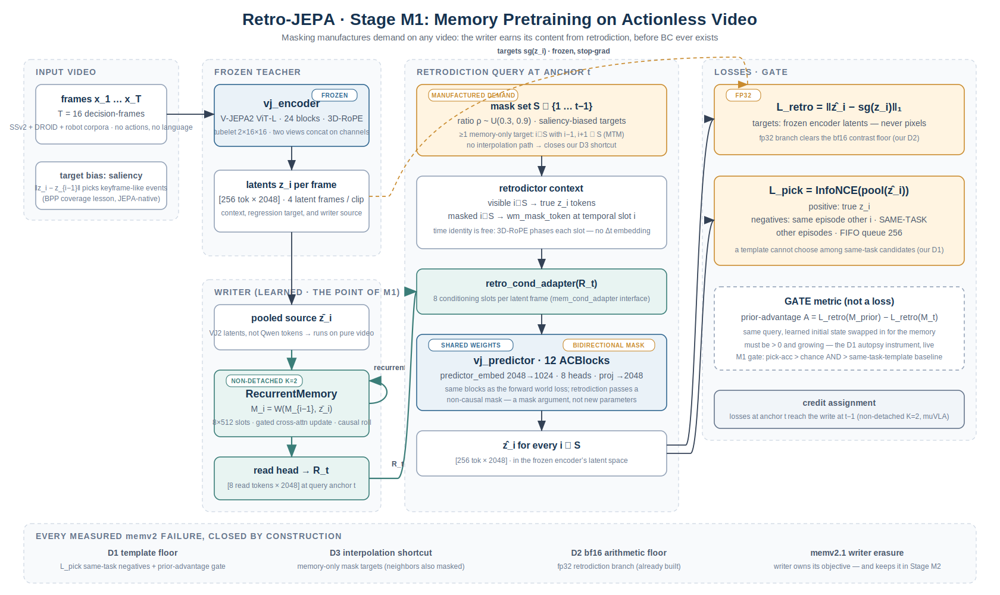
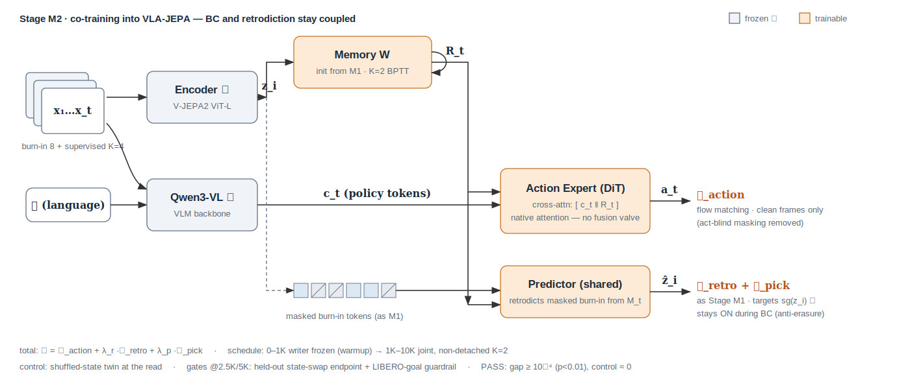

# Retro-JEPA (memv3): Learning Memory as the Time-Mirror of the World Model

**Date:** 2026-07-08 · **Branch:** `memexp` · **Predecessors:** memv1 pacemaker anatomy
(report ch. 1–2), memv2→2.4 masked-decision program (report ch. 3, §21–22, closed by
pre-registered G2 kill).

**Thesis.** VLA-JEPA's world loss trains a predictor to look *forward*; Retro-JEPA
trains the memory with the same machinery looking *backward*. A world model predicts
the future; a memory retrodicts the past — the same predictor blocks, mirrored in
time. The writer is genuinely **learned** (the paper's objective), it earns its
content from a self-supervised objective on **all video** (SSv2 + DROID + robot
corpora), and BC only ever meets a memory that already contains readable content.

---

## 1. Why this design — every memv2 conviction has a countermeasure

The memv2 program ended with a fully instrumented null; each measured failure maps to
one Retro-JEPA design element:

| measured failure (instrument) | Retro-JEPA countermeasure | literature anchor |
|---|---|---|
| L_rec solved at the task-template floor (D1) | discriminative **L_pick** over same-task negatives + **prior-advantage** live gate | TRLM (NeurIPS'24), CPC |
| masked targets interpolable from sighted neighbours (D3) | **memory-only mask targets** — masked frames whose neighbours are also masked | MTM (ICML'23) |
| loss contrast below bf16 arithmetic (D2) | fp32 retrodiction branch (`rec_loss_fp32`, already built) | ours |
| BC erases jointly-trained writer content (memv2.1; RoboMME ICML'26) | writer owns its objective in **both** stages; pretrained before BC exists; objective never turns off | CAMP, DVAE-hindsight |
| reader squelched via gateable side module (memv2/2.1 valves) | read tokens enter the action expert's **native cross-attention**; the fusion module is retired | muVLA |
| detached-TBPTT credit gap | **non-detached K=2** (muVLA's sweep: K=1-detached and K=8 both fail) | muVLA |
| demand scarce in data (C0: 5→47 % after certification) | **masking manufactures demand on any video** — the entire pretraining corpus becomes memory-training data | seed idea, hardened |
| black-frame act-blind masking damages BC (memv2.4 guardrail 6 %→1 %) | **removed** — masking lives only on the retrodiction side; the action loss sees clean frames | ours |

## 2. Memory construction (the writer)

Unchanged module, new source, new objective:

- **State:** `RecurrentMemory`, 8×512 slots, gated cross-attention update
  `M_i = W(M_{i-1}, z̄_i)` — causal, fixed-size, in-model, differentiable.
- **Source:** pooled frozen **V-JEPA2 latents** `z̄_i` (was: Qwen action tokens).
  This is what lets Stage M1 run on pure video with no VLM and no actions, and makes
  the same writer weights valid in both stages.
- **Read:** a read head produces `R_t` — 8 read tokens ×2048 — consumed by (a) the
  retrodictor's conditioning slots and (b) in M2 the action expert's attention.
- **Credit:** non-detached TBPTT, K=2 — the loss at anchor *t* reaches the write at
  *t−1*.
- Pre-registered variant **W2** (not round one): a test-time-regression write rule
  (Titans/TTT family) where the update is itself a gradient step on retrodiction
  error.

## 3. Stage M1 — memory pretraining on actionless video

**Data.** T=16 decision-frame sequences from SSv2 + DROID + robot corpora — no
actions, no language, no task labels. Demand is *manufactured* by the mask, not
certified from the data: this dissolves the C0 bottleneck (memv2 could only find
47 % demand-bearing samples; here every clip qualifies).

**Query construction (per sequence, at anchor t):**

1. Roll the writer causally over frames 1…t (it sees everything).
2. Sample mask set `S ⊂ {1…t−1}`, ratio ρ ~ U(0.3, 0.9), targets biased toward
   salient frames by ‖z_i − z_{i−1}‖ (a free, JEPA-native keyframe signal — BPP's
   coverage lesson without a VLM detector).
3. Enforce ≥1 **memory-only** target: some i∈S with i−1, i+1 ∈ S — no interpolation
   path exists for it (MTM's random-autoregressive constraint; strictly stronger
   than memv2.4's contiguous runs).

**Retrodictor** = the existing `vj_predictor` (12 ACBlocks, shared weights with the
forward world loss), with three call-level differences and no new blocks:

- context: true `z_i` tokens at visible slots, `wm_mask_token` at masked slots —
  time identity comes free from 3D-RoPE (the mask token is phased by its temporal
  grid position; no Δt embedding needed);
- conditioning: `retro_cond_adapter(R_t)` → 8 slots/frame (the `mem_cond_adapter`
  interface, new small module);
- attention mask: **bidirectional** within the query window (a mask argument;
  the world loss keeps its causal mask).

**Losses and gate:**

- `L_retro = ‖ẑ_i − sg(z_i)‖₁` — frozen-encoder latent targets, never pixels
  (V-JEPA2-AC recipe), fp32 branch.
- `L_pick` — InfoNCE: pooled ẑ_i must identify the true z_i against same-episode
  other-time and **same-task other-episode** negatives (FIFO 256). A template
  cannot choose among same-task candidates; only episode content discriminates.
  This is the D1 counter, in the loss itself.
- **Gate metric (not a loss):** prior-advantage
  `A = L_retro(M_prior) − L_retro(M_t)` — the same query scored with the learned
  initial state swapped in. Must be > 0 and growing. The D1 autopsy instrument,
  promoted to a live training gate.

**M1 pass rule (pre-registered):** pick-accuracy above chance *and* above a
same-task-template baseline, prior-advantage positive and growing, world-loss drift
within tolerance (shared blocks). Fail → predictor-sharing fallback (second
predictor instance initialized from the first) before any M2 spend.

## 4. Stage M2 — co-training into VLA-JEPA

**Architecture deltas vs memv2.4:**

- Writer initialized from M1; same source (VJ2 latents), same read head.
- **Reader = native attention:** `R_t` read tokens are appended to the policy
  tokens in the DiT action expert's cross-attention context. No
  SparseKeyMemoryFusion, no gates, no residual valve — the read is an attention
  choice inside the head BC already uses.
- **Retro head stays on:** the same M1 losses run on masked burn-in frames at every
  supervised decision — the anti-erasure lock. `L_total = L_action + λ_r·L_retro +
  λ_p·L_pick` (λ_r 0.5, λ_p 0.2 initial, as memv2).
- **Removed:** black-frame act-blind masking. The action loss trains on clean
  frames only.

**Schedule:** 0–1K warmup with the writer frozen (the reader learns to consume an
already-contentful state — SAM2Act+/CAMP graft), then joint to 10K with K=2
non-detached. Data: `memv2_stage2_mix` (34 % vanilla LIBERO / 20 % libero_mem /
47 % certified anchors).

**Control arm:** the **shuffled-state twin** — identical training, but the memory
state presented to the *reader* is episode-shuffled within the batch. If its action
loss and endpoints match the real arm, no content read formed. (Replaces privdec:
the control now sits at the read, where the question is.)

**Gate ladder (watcher reused, all pre-registered):**

| step | gate |
|---|---|
| M2 @2.5K / 5K / 7.5K | fwdseq state-swap endpoint n=32 (held-out, certified anchors) trending > 0 in the real arm, ≈ 0 in shuffled; prior-advantage > 0; LIBERO-goal 20-ep guardrail not collapsing |
| kill rule | endpoint flat at 5K **and** guardrail falling → scancel both arms |
| 10K endpoint | fwdseq n=96 both arms; MIKASA live/bypass/foreign (donor-keys fix in place); LIBERO-Mem; LIBERO full regression |
| decision rule | **PASS:** gap_rec ≥ 1×10⁻⁴ (p<0.01), shuffled ≈ 0, LIBERO-goal ≥ 60 % → scale up + closed-loop chapter. **FAIL:** the negative result now covers writer-owned objectives too — the paper ships with the strongest instrumented null available |

## 5. Implementation map (what is reused / new)

| component | status |
|---|---|
| `vj_encoder` (24 blocks, frozen) | unchanged — tokenizer, target teacher, writer source |
| `vj_predictor` (12 ACBlocks) | reused, shared weights; retrodiction = bidirectional mask argument |
| `wm_mask_token` | reused as masked-past placeholder |
| `RecurrentMemory` | reused; source switched to pooled VJ2 latents |
| `retro_cond_adapter` | **new, small** (mem_cond_adapter interface) |
| pick head | **new, tiny** (nce_head pattern) |
| M1 video trainer path | **new**: masked-past query builder on the video dataloader (SSv2 path exists; extend with sequence sampling) |
| M2 reader | **delta**: append `R_t` to DiT cross-attn context; delete fusion-module call |
| fp32 branch, fwdseq discriminator, gate watcher, wandb hooks | reused as-is |
| SparseKeyMemoryFusion, act-blind masking | **retired** |

## 6. Plan and compute

| phase | content | wall time |
|---|---|---|
| M0 | this doc + pre-registration review | done |
| M1 impl | writer source switch, query builder, retro losses, tests | ~1 day |
| M1 train | 20–30K steps, 8×H100, video corpora; gated | ~1 day |
| M2 impl | reader delta, shuffled-state control, config | ~½ day |
| M2 train | 2 arms × 10K steps, 8×H100 each; gate ladder | ~1 day |
| endpoint | n=96 battery + closed loop + report chapter | ~½ day |

Track A (paper restructure + related-work survey from the two literature sweeps)
runs in parallel and absorbs the outcome either way.

## 7. Relationship to the literature (positioning)

Independent confirmations of the memv2 null: RoboMME (ICML'26; six recurrent-latent
variants at the no-memory baseline), MIKASA-Robo (NeurIPS'25; all imitation
objectives at chance floor), Embodied-SlotSSM (AAAI'26; dense aux supervision, no
autonomous read), BPP (aux reconstruction losses actively hurt). Design sources:
PTP (retrodict episode-specific targets), Belief State Transformer (backward
prediction forces belief states), MTM (mask-pattern anti-interpolation), TRLM
(backward likelihood is template-resistant), DVAE-hindsight (writer gets its own
asymmetric objective), V-JEPA2-AC (frozen latent targets, freeze-then-attach),
muVLA (native-attention memory tokens, K=2), CAMP/SAM2Act+ (schedule), Titans/TTT
(W2 variant). What is ours: the time-mirrored shared-predictor formulation, the
demand-manufacturing framing, the discriminative retrodiction with same-task
negatives, the prior-advantage gate, and the instrument suite that makes the
outcome interpretable either way.
