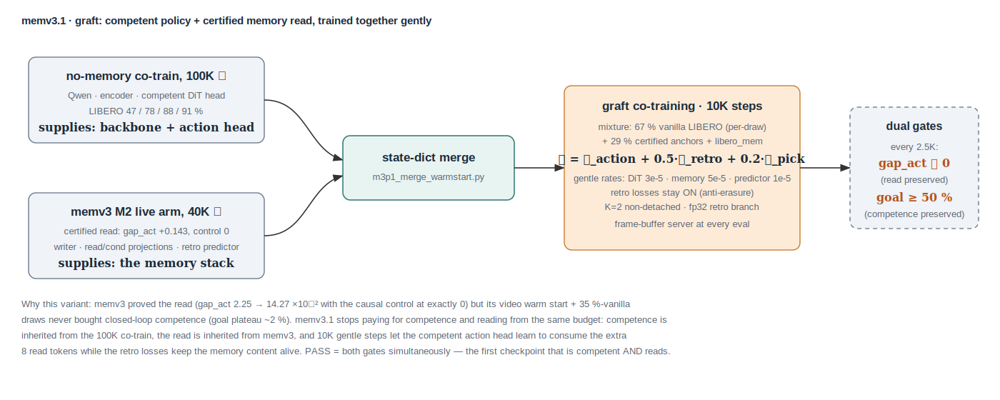

# memv3.1 — Graft: Competent Policy + Certified Memory Read

**Date:** 2026-07-12 · **Branch:** `memexp` · **Predecessor:** memv3 Retro-JEPA
(`memory-v3-retro-jepa-report.md`): the read is established (gap_act
+2.25→+14.27×10⁻² over 2.5K→40K, causal control exactly 0 at nine
measurements, 30–40 % action-loss advantage) but closed-loop competence never
formed (LIBERO-goal plateau ~2 %) because the run paid for competence and
reading from the same budget — a video warm start and only ~35 % vanilla
draws (per-draw semantics: `balance_dataset_weights=False`, so shares are
weight/Σweights, size-independent — corrected from the earlier
frames-weighted accounting).

**The variant in one sentence:** stop relearning what already exists — take
the *competent action head* from the no-memory 100K co-train, take the
*reading memory stack* from memv3's 40K live arm, merge, and co-train gently
for 10K steps so the head learns to consume the 8 read tokens while the
retro losses keep the memory's content alive.

## Construction

| piece | source | rationale |
|---|---|---|
| Qwen, encoder, **DiT action head** | `vlajepa_cotrain_allv2` step_100000 | LIBERO 47/78/88/91 % — competence is inherited, not retrained |
| **memory stack** (writer, read/cond projections, mask token) + **retro predictor** | `vlajepa_m3_retro_m2` step_40000 (live arm) | the certified read (+0.143, control 0); the predictor carries the retrodiction skill the retro losses need |
| merge | `scripts/analysis/m3p1_merge_warmstart.py` | pure state-dict surgery; donor prefixes replace/extend base keys |

## Training (`scripts/config/vlajepa_m3p1_graft.yaml`)

- **Mixture `memv3p1_mix` (per-draw):** 67 % vanilla LIBERO ×4 suites,
  4 % libero_mem, 29 % certified anchors ×0.5 — competence-first, demand kept.
- **Gentle rates:** DiT 3×10⁻⁵, memory 5×10⁻⁵, predictor 1×10⁻⁵, base
  5×10⁻⁵, warmup 500 — the head must adapt to the read tokens without
  forgetting; the memory must stay readable without drifting.
- Unchanged from memv3: retro+pick losses on (0.5/0.2, fp32), K=2
  non-detached, frame-buffer serving, schema 3, frozen Qwen/encoder.
- 10K steps, one arm (the read's causal control is already established;
  memv3's prior-read arm remains the reference).

## Pre-registered dual gates (every 2.5K, watcher-automated)

PASS requires **both simultaneously** — the first checkpoint in the program
that is competent *and* reads:

1. **Read preserved:** fwdseq `gap_act` ≫ 0 (memv3 endpoint reference
   +0.143; alarm if it collapses toward 0 — BC erasure of the graft).
2. **Competence preserved:** LIBERO-goal guardrail ≥ 50 % (allv2 reference
   78 %; alarm if the read tokens disrupt the head).

Failure modes and responses (logged in the decision log): read collapses →
raise retro weight / freeze writer; competence collapses → lower memory LR /
freeze memory for a warmup. Endpoint at 10K: fwdseq n=96, LIBERO 4-suite
regression, LIBERO-Mem, MIKASA — the same battery, now with a policy that
can act.
